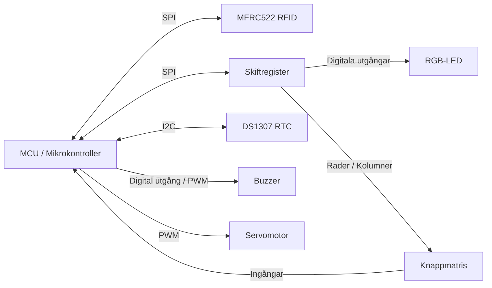

# Arduino Uno Bas-skelett för inlämningsuppgiften delmoment 3

I denna sista del är det dags att visa Sebbson:s Stig In AB att ni har vad som krävs för att bli konsulter till dem. En leverabel prototyp är det som ska lämnas in. Dvs ni ska köra en demo på produkten samt lämna in kod-basen.

Det har delgivits en drivrutin till det kommunikationsprotokoll som Sebbson:s använder för att möjliggöra validering i backend. Sebbson gillar att ha all makt och bestämma vilka som får komma in eller inte. Se under /docs för mer information gällande protokollet. 

## För Godkänt
För att Sebbson ska kunna godkänna produkten krävs det följande implementation:
- I väntande fas så ska lysdioden lysa rött för att signalera att passage ej är möjligt. Kommer det en användare och blippar passagekort/tag så ska följande hända.
    - Vi skickar en förfrågan till backend med UID
        1. Får vi en korrekt respons med nytt SID samt en förfrågan på pinkod ska lysdioden börja blinka gult och användaren har möjlighet att knappa in pinkod.
        2. Får vi inte någon respons inom rimlig tid så ska lysdioden blinka blått ett litet tag och systemet går tillbaka till IDLE

- Vid inmatning av pinkod så har användaren 10 sekunder på sig att slå in pinkoden. Varje gång användaren trycker ner ett knapptryck ska en liten respons visas för användaren genom att lysdioden lyser grönt i 100ms. 
    - Skrivs inte pinkoden in i tid så går vi tillbaka till IDLE
    - Matas en pinkod in så går vi över till valideringsfasen genom att skicka PIN till backend.
  
- Vid validering väntar vi på respons från backend om vi har access eller inte. Får vi inget svar inom rimlig tid så ska vi blinka blått som tidigare vid avsaknad av svar från backend. Får vi tillbaka access denied så ska vi blink rött ett tag och sedan gå tillbaka till IDLE. Får vi access granted så går vi in i nästa fas.
  
- Vid access OK så ska dörren öppnas i 5 sekunder vilket betyder att servomotorn ska öppna sig samt buzzern ska låta och lysdioden ska lysa grönt under den tiden. Efter fem sekunder går vi tillbaka till IDLE.


### Kod
Kodmässigt vill Sebbson att ni använder *state-machine* för att säkerställa bra kod-flöde!


## För Väl Godkänt

För att imponera på Sebbson så krävs det lite extra förutom att allt i Godkänt. Vi behöver visa för honom att vi kan jobba med Wifi och ESP-mikrokontrollers. Istället för att prata via UART direkt till backend ska det ske via en ESP32 som agerar gateway för att koppla upp till Sebbson:s webbservrar istället. Det som behövs göras är:
1. Implementera UART på ESP32 som kan kommunicera med Arduino
2. Översätt kommandon till JSON-format för att kunna prata med webbserver (dokumentation kommer snart)
3. Agera gateway mellan Arduino och webbserver


---
### Varning
Förbehåller mig rätten för olycklig felkopplingar och andra knasigheter! Eventuella krockar med pins och timers och annat dylikt.

//Sebbson

PS: Vi kommer stega igenom alla delarna tillsammans framöver!


## Överblick

```
---
                         ┌─────────────────┐
                         │   DS1307 RTC    │
                         │      I2C        │
                         └────────┬────────┘
                                  │
                                  │ SDA / SCL
                                  │
┌─────────────────┐        ┌──────▼───────┐        ┌─────────────────┐
│ MFRC522 RFID    │◄──────►│              │◄──────►│ Skiftregister   │
│ SPI             │  SPI   │     MCU      │  SPI   │ SPI             │
└─────────────────┘        │              │        └──────┬──────────┘
                           └───┬────┬─────┘               │
                               │    │                     │
                               │    │                     ▼
                               │    │              ┌──────────────┐
                               │    │              │   RGB-LED    │
                               │    │              └──────────────┘
                               │    │
                PWM / digital  │    │ PWM
                               │    │
                         ┌─────▼─┐  ┌▼────────────┐
                         │Buzzer │  │ Servomotor  │
                         └───────┘  └─────────────┘


                  ┌─────────────────────┐
                  │     Knappmatris     │
                  └───────┬────────┬────┘
                          │        │
                          │        └──────────► MCU-ingångar
                          │
                          └──────────────────► Skiftregister
```